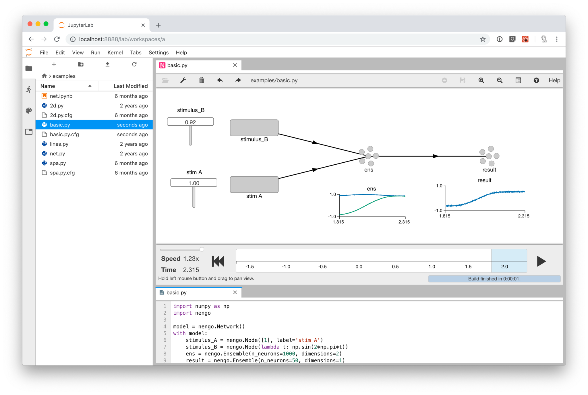

# jupyterlab-nengo

Use the Nengo GUI within JupyterLab.

**Warning: The JupyterLab extension API is not stable yet and thus this extension
may break at any time.**



## Prerequisites

* JupyterLab
* [Nengo GUI](https://github.com/nengo/nengo-gui) development version from
  GitHub. (Required features should be included in version 0.4.4 whenever it
  gets released.)

## Installation

### Activate the Nengo GUI Jupyter notebook server extension (backend)

Add the following to your `~/.jupyter/jupyter_notebook_config.json`:

```json
{
  "NotebookApp": {
    "nbserver_extensions": {
      "nengo_gui.jupyter": true
    }
  }
}
```

### Install the JupyterLab extension (frontend)

Run:

```bash
jupyter labextension install @jgosmann/jupyterlab-nengo
```

## Development

For a development install (requires npm version 4 or later), do the following
in the repository directory:

```bash
npm install
npm run build
jupyter labextension link .
```

To rebuild the package and the JupyterLab app:

```bash
npm run build
jupyter lab build
```

